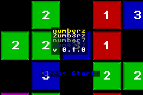
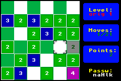

# Numberz-GBA

A number game for GameBoy Advance

## Screenshots

| title screen                 | ingame                        |
| ---------------------------- | ----------------------------- |
|  |  |

## Objective

Every tile needs to be moved exactly once in any direction (horizontal, vertical, diagonal).
The number of steps is written on the tile. When all tiles have moved, the level is cleared.

## Keys

| Button           | Use                                    |
| ---------------: | -------------------------------------- |
| <kbd>D-Pad</kbd> | Moves cursor                           |
| <kbd>A</kbd>     | Select Source and Target tile          |
| <kbd>B</kbd>     | Deselects tile or undoes the last move |
| <kbd>Start</kbd> | Enters the menu(s)                     |

## Run in Browser

Click [here](https://gba.ninja/?autorun=https://carstene1ns.github.io/numberz-gba/numberz.gba) to play!
Press <kbd>ESC</kbd> for configuration etc.

## Compilation

Install devkitARM, libtonc and maxmod.

Enter `make` to build.

## License

MIT

### Used Software
 - `tonclib` by Jasper Vijn
 - `maxmod` by Mukunda Johnson
 - `posprintf` by Dan Posluns

### Original Game
 - `zNumbers` by Karl Bartel

### Music
 - "a short Tune" by sit
 - "Tranze seven" by dr.awesome

## TODO

 - Add Mode selection
 - Implement Password entry
 - Cleanup code
 - Game Over and Game Complete screens
